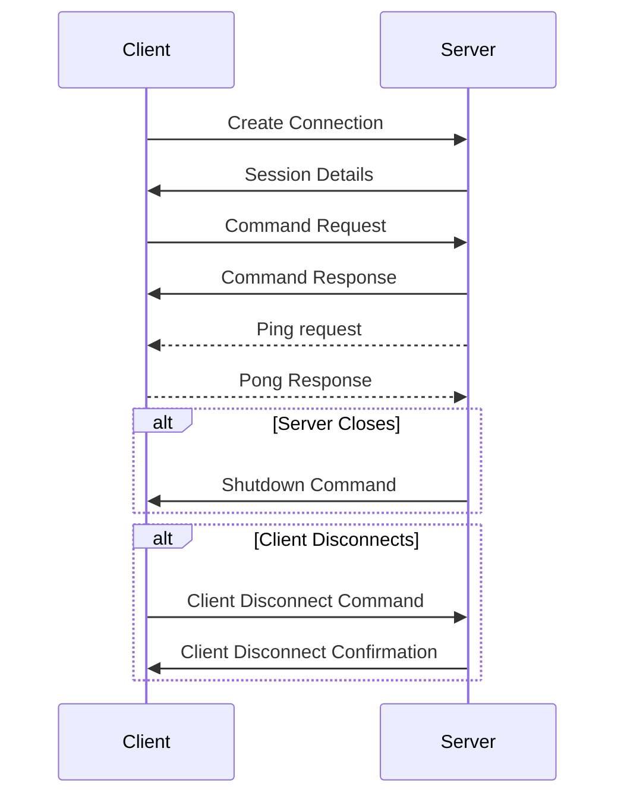

# Overview
The server handles requests through TCP.
The basic idea is that a client connects to the server and the server assigns a session to the connection. This allows a client to create multiple connections to the database.

The client can then request commands to the database. The server will respond to the client and give a response. The server can tell the client that it is shutting down, and the client can tell the server that it is disconnecting. 
Connections can last for some time. We can not figure out if a client has crashed and failed to tell us that they have disconnected, or there is network problems. Ping the client and have them respond to us allows us to figure that out a bit more... _Though having the TCP socket open might allow us to figure that_ 

